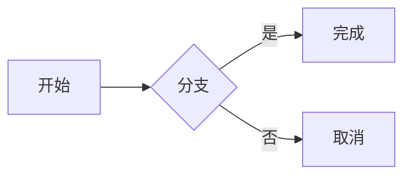
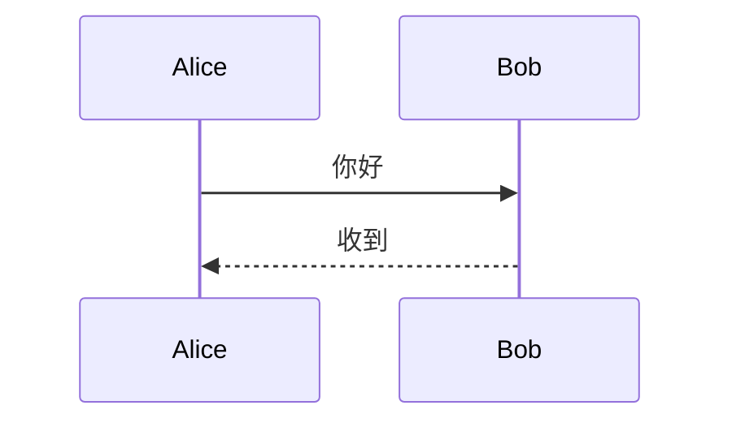

# 标题与段落

**粗体**、*斜体*、`行内代码`、[链接](https://example.com)、==高亮==、~~删除线~~。

源码换行
仍在同一段。

## 列表

- 无序一项
- [ ] 未完成
- [x] 已完成
  - 缩进子项

1. 有序 A
2. 有序 B

> 引用段落

---

## 代码

```rust
fn hello() {
    println!("hello");
}
```

```cs
public class Demo {
    public int Add(int a, int b) => a + b;
}
```

```js
const greet = (name) => `hi ${name}`;
```

```ts
function id<T>(x: T): T { return x; }
```

```python
def hello(name: str) -> str:
    return f"hi {name}"
```

```json
{ "ok": true, "n": 1 }
```

```yaml
name: rustmarkdown
tab: 4
```

```ps1
Get-ChildItem -Path $HOME | Select-Object -First 3
```

```sql
SELECT id, name FROM users WHERE active = 1;
```

## Mermaid





## 表格

| 名称 | 路径 |
| --- | --- |
| 短列 | D:\example\very\long\path\file.md |
| 中文 | 内容 |

<details>
<summary>折叠块</summary>

内部 **Markdown**。

</details>

